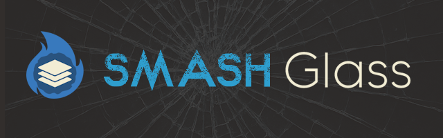

<!-- PROJECT LOGO -->
<br />
<p align="center">
  
  <h3 align="center">
  Smash Glass
  </h3>

  <p align="center">
    Overlay application to accompany Smash Soda
    <br />
    <a href="https://github.com/MickeyUK/SmashSoda/releases">Latest Release</a>
    ·
    <a href="https://github.com/MickeyUK/SmashSoda/issues">Report Bug</a>
    ·
    <a href="https://github.com/MickeyUK/SmashSoda/issues">Request Feature</a>
  </p>
</p>

<!-- TABLE OF CONTENTS -->
<details open="open">
  <summary><h2 style="display: inline-block">Table of Contents</h2></summary>
  <ol>
    <li>
      <a href="#about-the-project">About The Project</a>
    </li>
    <li>
      <a href="#how-to-use">How to Use</a>
    </li>
    <li><a href="#testing">Testing</a></li>
    <li><a href="#plugins">Plugins</a></li>
    <li><a href="#obs">OBS</a></li>
    <li><a href="#Development">Development</a></li>
    <li><a href="#contributing">Contributing</a></li>
    <li><a href="#license">License</a></li>
    <li><a href="#contact">Contact</a></li>
    <li><a href="#acknowledgements">Acknowledgements</a></li>
  </ol>
</details>


## About the Project

Here is the source code for the overlay application included with <a href="https://github.com/mickeyuk/SmashSoda">Smash Soda</a>. It has been developed with <a href="https://wails.io/">Wails version 3</a>. It is not intended to be run standalone, and won't work with <a href="https://github.com/v6ooo/ParsecSodaV">Parsec Soda V</a>'s Web Sockets widget. The overlay uses <a href="https://developer.microsoft.com/en-gb/microsoft-edge/webview2/?form=MA13LH">WebView2</a>. Instructions for using the overlay with Smash Soda can be found <a href="https://github.com/soda-arcade/smash-soda/wiki/overlay">here</a>.

The source code is made public in case anybody wants to modify and compile for their own purposes (or contribute to the project!).

Issues and feature requests should be made in the <a href="https://github.com/MickeyUK/SmashSoda/issues">Smash Soda repository</a>.

<table>
    <tr>
        <td align="center">
           <a href="https://github.com/MickeyUK/SmashSoda/releases">
               
               <div>Download</div>
           </a>
           <div>Download latest<br>version</div>
        </td>
        <td align="center">
           <a href="https://github.com/MickeyUK/SmashSoda/issues">
               
               <div>Issues</div>
           </a>
           <div>Report issues and<br>request features</div>
        </td>
        <td align="center">
           <a href="https://discord.gg/9ZHmwce">
               
               <div>Discord</div>
           </a>
           <div>Join the Discord<br>community!</div>
        </td>
        <td align="center">
           <a href="https://github.com/MickeyUK/SmashSoda/wiki">
               
               <div>Wiki</div>
           </a>
           <div>Read the full wiki<br>guide here!</div>
        </td>
    </tr>
</table>

## How to Use

Download the latest version of the overlay here: <a href="https://github.com/soda-arcade/smash-soda-overlay/releases">Latest Version</a>

Extract the contents to the *overlay* folder inside Smash Soda (if a overlay folder does not exist, create one).

You do not start the overlay application yourself. Smash Soda will automatically launch it when you begin hosting your room (when enabled). Inside Smash Soda, you can find the widget for enabling it and customizing the settings here:


The overlay has some built in hotkeys:

<table>
  <thead>
    <tr>
      <td><b>Hotkey</b></td>
      <td><b>Action</b></td>
    </tr>
  </thead>
  <tbody>
    <tr>
      <td>CTRL + SHIFT + C</td>
      <td>Toggle the chat window.</td>
    </tr>
    <tr>
      <td>CTRL + SHIFT + M</td>
      <td>Toggle the move mode for moving widgets around manually.</td>
    </tr>
    <tr>
      <td>CTRL + SHIFT + Left Arrow</td>
      <td>Decrease the overlay opacity.</td>
    </tr>
    <tr>
      <td>CTRL + SHIFT + Right Arrow</td>
      <td>Increase the overlay opacity.</td>
    </tr>
    <tr>
      <td>CTRL + SHIFT + Up Arrow</td>
      <td>Increase the overlay scale.</td>
    </tr>
    <tr>
      <td>CTRL + SHIFT + Down Arrow</td>
      <td>Decrease the overlay opacity.</td>
    </tr>
    <tr>
      <td>CTRL + SHIFT + F1</td>
      <td>Show the overlay settings window.</td>
    </tr>
  </tbody>
</table>

You can customize various settings of the overlay with the built in settings window. You can display it by pressing the default hotkey (CTRL + SHIFT + F1) or by clicking the "Settings" button inside the Smash Soda overlay widget.


## Themes

The overlay has a simple theme system that lets you load custom CSS files. You can place these CSS files in the *themes* folder. The file name is used as the name for that theme.

You can find a template for making your own themes here: <a href="https://raw.githubusercontent.com/soda-arcade/smash-soda-overlay/refs/heads/main/frontend/src/css/main.css">Template File
</a>

Refrain from using any positioning or size rules, as the overlay allows for resizing widgets dynamically.

## Plugins

The overlay has a simple plugin system for creating custom widgets on the overlay. A plugin is a subfolder inside the *plugins* folder, and consists of a HTML, CSS and JavaScript file with the same name as the subfolder. CSS and JavaScript files are optional.

```
- plugins
  - customplugin
    - customplugin.html
    - customplugin.css
    - customplugin.js
```

The plugin system is only really intended for making your own personal plugins, or offical ones created by [Trybuchet](https://github.com/trybuchet/). The plugin JavaScript is evaluated in an unsafe way, so downloading plugins from other users can be dangerous if you do not 100% trust that user.

## OBS

The Smash Soda overlay application is primarily intended for users who want to see details about their room at all times and only have one monitor. For those wishing to build their own OBS overlays, it's as simple as connecting to the websocket server that Smash Soda creates when hosting, and then displaying the info how you want.

Check out the obs_example.html for a very basic example of how to make a static HTML with vanilla JavaScript, to render data from Smash Soda.

Here is a static web page template for displaying your Parsec room chat in OBS...it'll also broadcast display Twitch chat in your Parsec room!

[https://github.com/trybuchet/twitch-overlay-widget](https://github.com/trybuchet/twitch-overlay-widget)

https://github.com/trybuchet/

## Development

This is for those wishing to edit the overlay's code and/or contribute to the project. The overlay is built in the <a href="https://v3alpha.wails.io">Wails v3</a> framemwork. Follow their guide for setting up a development environment <a href="https://v3alpha.wails.io/getting-started/installation/">here</a>. (Note this overlay is compatible with Smash Soda **version 7.x.x** onwards).

```
git clone https://github.com/Smash-Soda-Team/smash-soda-overlay
```

Make a copy of **.env.example** and rename the copy to **.env**. Here you can customize the various environment variables for the app.

To run the overlay in dev mode:

```
wails3 dev
```

To build the application:

```
wails3 task windows:build
```

----

Socket messages from Smash Soda come in this JSON format:
```json
{
  "event": "event name",
  "data": {}
}
```
This is than transmitted across the app with the eventBus, which is hooked on to the window object to keep things simple. You can then listen to events like:
```ts
window.eventBus.on('event name', (data: any) => {
  // Do thing
});
```

----

The overlay has a built in websocket server, allowing you to test it without Smash Soda. The websocket server can be enabled and customized in the **.env** file.

You will also find **Web_Socket_Tester.html** inside the **tools** folder that is set up for easy testing, allowing you to send data to the overlay.

## Contributing

See the [open issues](https://github.com/trybuchet/SmashGlass/issues) for a list of proposed features (and known issues).

Would you like to contribute to the project? That's great! Here's what you do:


1. Open a new issue reporting what you're going to do.
2. Fork this repository.
3. Create a branch for your feature.
4. Make your local changes.
5. Submit a pull request.

If this is helpful to you and you'd like to say thanks, then please visit our [Patreon](https://www.patreon.com/cw/SodaArcade) or our [Ko-Fi](https://ko-fi.com/sodaarcade). Smash Soda and Soda Arcade depends on supporters to keep the service alive and free!

## License

See `LICENSE.txt` for more information.


## Contact


Project Link: [https://github.com/trybuchet/SmashGlass](https://github.com/MickeyUK/SmashSoda)


<!-- ACKNOWLEDGEMENTS -->
## Acknowledgements

* [MickeyUK] - [GitHub](https://github.com/MickeyUK) - Smash Soda Project Lead